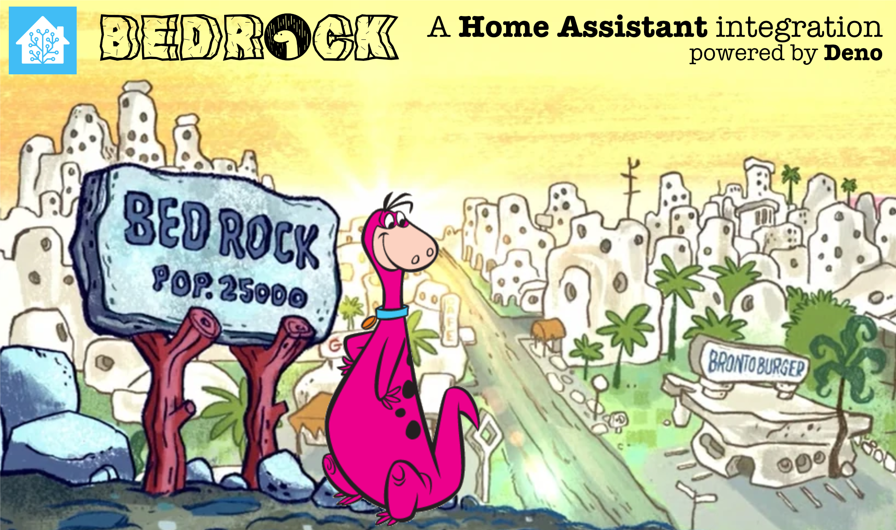

<!-- ⚠️ This README has been generated from the file(s) "blueprint.md" ⚠️-->

<h1 align="center">@samantha-uk/bedrock</h1>

   

## Table of Contents

* [Description](#description)
* [Why Bedrook?](#why-bedrook)
* [Support](#support)
* [Know Issues](#know-issues)
* [Contributing](#contributing)
	* [License](#license)

# Description
Bedrock is a Docker based, backend server for Home Assistant; supporting zigzag.

# Why Bedrook?
Well, Bedrock implies a foundation or solid basis to build something.
Bedrock uses Deno as a core element ... Deno ... Dino, OK, it's corny but it will allow a number of Flintstone based names.

# Support
- Raise an [issue](https://github.com/Samantha-uk/one/issues) and include your browser console output.
- Ask a question in 

# Know Issues
At present Bedrock does ... nothing!
Features will be added to zigzag that are dependent on Bedrock.

# Contributing
Contributions, issues and feature requests are welcome.
Feel free to check the issues page if you would like to contribute.
[Check the contributing guide](/CONTRIBUTING.md).

## License
	
Licensed under [MIT](https://opensource.org/licenses/MIT).
